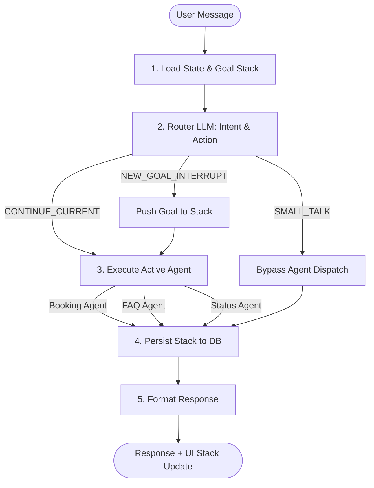

# Goal-Stack Orchestrator

An enterprise-grade Conversational AI backend demonstrating **conversation state as a stack of goals**. This project is a working implementation of a modern "Super Agent" architecture (similar to Yellow.ai's OrchLLM), supporting multi-intent routing, context switching, and zero-shot NLP.

## 🚀 Key Features

*   **Goal-Stack Architecture:** Handles non-linear conversations. If a user interrupts a flight booking to ask a question, the booking is paused (pushed down the stack), the question is answered, and the booking resumes exactly where it left off.
*   **Multi-Intent Routing:** The Router LLM identifies intent types and operations (e.g., `NEW_GOAL_INTERRUPT`, `RESUME_PAUSED_GOAL`, `SMALL_TALK`).
*   **Hybrid Agent Model:** Coordinates between LLM-powered agents (Booking, FAQ) and deterministic rule-based agents (Status Check).
*   **Extensible Design:** Agents are treated as independent nodes in a LangGraph state machine, making it trivial to add new capabilities.

## 🧠 Architecture Overview

The system uses a LangGraph-based Orchestrator that processes incoming messages through a strict pipeline:



## 🛠 Tech Stack

*   **Backend:** FastAPI, LangGraph, Pydantic, aiosqlite (WAL mode)
*   **Frontend:** Next.js 14, React, Tailwind CSS
*   **LLMs:** Groq (Llama 3 8B for Routing) & Google Gemini (1.5 Flash for Agents)

## 📦 Local Setup

### 1. Environment Variables

Create `.env` files in both directories:

**`backend/.env`**
```env
GROQ_API_KEY="gsk_..."
GOOGLE_API_KEY="AIza..."
```

**`frontend/.env.local`**
```env
NEXT_PUBLIC_API_URL="http://localhost:8000"
```

### 2. Backend (FastAPI)

```bash
cd backend
python -m venv venv
# Windows: .\venv\Scripts\activate
# Mac/Linux: source venv/bin/activate
pip install -r requirements.txt

# Start the server
fastapi dev app/main.py
```

### 3. Frontend (Next.js)

```bash
cd frontend
npm install

# Start the dev server
npm run dev
```

Navigate to `http://localhost:3000` to interact with the agent.

## 🧪 Running Tests

The backend includes a comprehensive test suite covering the Goal-Stack Manager, Router classification, and an end-to-end integration lifecycle test.

```bash
cd backend
pytest tests/
```

## 🐳 Docker Deployment

The project includes a `docker-compose.yml` for isolated containerized deployment.

```bash
docker-compose up --build
```
*Note: SQLite database state is persisted via a Docker volume.*